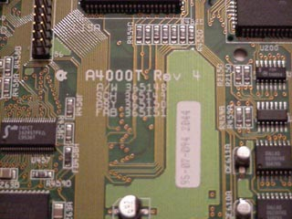

# Background Information

In this section you will find some background information on
Amigas.

{ .center }

## Subsections

- [Custom Chips](custchips.md)
- [Amiga RAM](ram.md)
- [Kickstart](kickst.md)
- [Zorro Bus](zorro.md)
- [Autoconfig](autoconfig.md)
- [AmigaDOS Commands](amigados.md)
