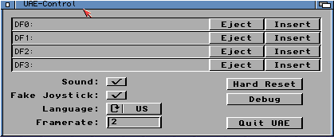
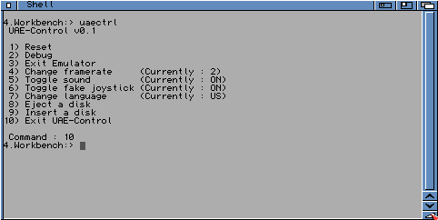

# Amiga Programs

Along with the WinUAE emulator program, some programs are
supplied in the 'Amiga Programs' folder in the C:\Program
Files\WinUAE folder. Here is an explanation of what these files
are for and where to copy them to:

## MouseHack

Copy this program file to your C directory on your Workbench
disk or hard disk. This program will hack your mouse connected
to your PC to work with WinUAE. In most cases it may not be
needed. You can auto run it by adding a line to the
s:user-startup file on your Workbench disk. Needed when using
tablets. Tablets only work properly if you select "mousehack
mouse" and run mousehack on the Amiga side.

## Picasso96fix

Copy this program file to your C directory on your Workbench
disk or hard disk. This program will fix Picasso 96 RTG screens
greater than 1024 pixels when using your PC's graphics card
with the uaegfx driver in WinUAE. Load it before LoadWB in the
startup-sequence. The **Picasso96fix.bb** file is
the source code to this program written in Blitz Basic.

## rtg.library

Retargetable Graphics Library. Copy this library file to
your libs:picasso96. This library will increase the speed of
WinUAE a lot.

## timehack

This tool synchronizes the Amiga time with the current
Windows time every second. You need this when you use the
hibernation feature of your PC and resume to get exact time. If
you need exact time (for compiler make) it is also recommended
to use this because UAE cycletiming differs of about 1-2
seconds per hour.

Copy it to the Amiga system directory c. Start it in your
Userstartup with the command run >nil: timehack.

## transdisk

Copy this program file to your C directory on your Workbench
disk or hard disk. This can Transfer Disk images to or from
floppy disk to an image or vice versa in ADF (Amiga Disk
Format). Type *transdisk ?* for more options. See
[Create Image Files](../howto/imagefiles.md) page
for more details on this program.

## transrom

Copy this program file to your C directory on your Workbench
disk or hard disk. This can Transfer the Kickstart ROM image
from a real Amiga to an image file to use with your Amiga
Emulator. It will produce either a 256K or 512kB sized file.
See [Create Image Files](../howto/imagefiles.md)
page for more details on this program.

## UAE

Copy this file to the AHI driver drawer in Devs on your
Workbench disk or hard disk. It is used to emulate the Amiga's
sound system using AHI retargetable sound driver system.

## UAE.audio

This is the AHI Driver for UAE. It enables support for
recording and playback with a sampling rate up to 96 kHz in 16
bit. Copy this file to the Devs:AHI driver drawer in Devs on
your Workbench disk or hard disk. It is used to emulate the
Amiga's sound system using AHI retargetable sound driver
system. This driver works fully independent from Paula sound.
For a speed boost on slower systems, you can set the Paula
buffer to 5 or 6, and chose 11kHz Mono, which is enough to hear
system sounds.  
If you installed the driver correctly, it should offer you only
1 mode: UAE HiFi stereo++.

## UAE\_German

This is a German keymap file for access to @\~{[]} with
ALT-GR like windows. Copy it to devs/keymaps and select in
Input prefs.

Note: This is an old one that works in input compatibility
mode. For 100% compatibility Mode (Euro Char) use
German\_keymap\_new.lha in this folder and choose anything other
in input tab then Compatibility Mode and remap # Key to
0x2b.

## uae\_rcli

Remote CLI. Usage: uae\_rcli [?|-h] [-debug] [-nofifo]
[&lt;delay>]

## uae-control

Copy this program file to your Utilities folder or some
other folder on your Workbench disk or hard disk. It will
provide a user interface within the emulator to control the
floppy drives, reset, quit and other features without having to
press F12 to bring up the WinUAE interface.

{ .center }

## uaectrl

Copy this program file to your C directory on your Workbench
disk or hard disk. This is the Shell equivalent of the
uae-control program where you can change floppies, sound,
joystick, reset or quit the emulator from a simple text
menu.

{ .center }

## WinUAEclip

This program allows you to have access to Windows Clipboard
so you can copy/paste files from/to WinUAE.

## WinUAEnforcer

This program allows Enforcer support to detect bad memory
access when developing programs or debugging. For 100% safety,
use [JIT](../emulation/jit.md) in Indirect Mode.
Make sure you use a tool that moves your VBR to Fast RAM. MCP
or some other tools on Aminet do that. You can also use
Segtracker from a real Amiga to find the program and offset of
a hit.

## winxpprinthelper

Not sure what this does yet. Need printer switched on before
running this.

## p96\_uae\_tweak

It must run after P96 monitor drivers in user startup.  
If you have copy this program to *c:*, then type
*>nil: c:p96\_uae\_tweak* in the CLI.  
It is also recommended to set P96 memory from the 4 MB AIAB
config to 16 or 32 MB, because it works faster. If not enough
graphics card space is free you will see flicker as before and
slower moves. Save the configuration and restart WinUAE when
you have increased the graphics memory size. Crashes may occur
when you only reboot the emulated Amiga.  
To test it you can boot AIAB open the screenmode prefs window.
Now put the screenmode prefs window to back and move it around
underneath other windows.  
If the window moves fast and does not flicker all, you are
done. With that patch it is also impossible that P96 graphics
actions can block WinUAE, so you get no AHI 16bit sound
stuttering when doing a lot of graphics actions.  
The patch splits large P96 blits (>60 pixels) in smaller
blocks and checks in all blocks if a 16bit AHI buffer is free.
This avoids speed losses and sound stuttering with 4ms AHI
latency. Swapbitmaprastport (used for solid window moving and
some slow layer actions) is patched to use UAE Blitter
functions that exchange the data directly instead calling 3
times EOR. It is faster and avoids the heavy flickering when
moving a smart layer window underneath another window.

## ahitweak

**Usage: AHItweak posoffset,pollrate**

This is a program you can start from the CLI or user-startup
and allows you to tune the AHI driver for better latency,
because on Windows XP the play pointer position has a delay
depending on the system and sound card used. Most users do not
need this tool, but if you have crackle problems with 16bit
AHI, play a song and try values of 50, 200, 500, 2000, -50,
-200, -500, and -2000. With some trying, you may be able to get
good results.You may also try to set the pollrate which WinUAE
checks for buffers freely between 10 and 60. If you notice a
speed loss you should set it to 60. If you use low latency
music software that lets you chose AHI block sizes less than 8
ms (AHI uses 20ms by default) you can set this to a lower value
if you hear crackle.

## p96refresh

Start this program to get higher mouse pointer redraw rates
than 50Hz with P96. Results are seen immediately after call.You
can start this in your user-startup for automatic load during
booting the system.  
**Note:** If you use this, you must check if your
CPU IDLE slider is set in correct position. In the worst case,
the Amiga system clock will run slower. Set the IDLE slider so
that in Windows task manager the CPU load of a Workbench screen
shows about 10-15%.  
**Example:** p96refresh 75 sets the redraw rate to
75Hz. It is recommended to set the rate according to the actual
monitor refresh rate, or the doubled number. Do not set it
higher or you get a speed loss greater than 2%.
