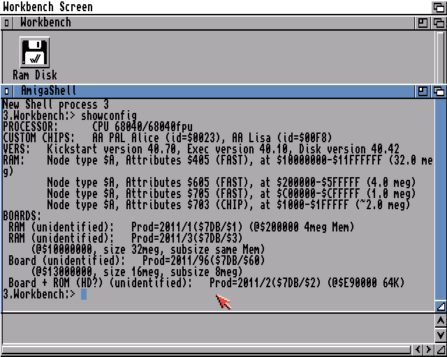

# The Emulation

There are several ways to improve the experience, such as
video acceleration, speed improvements, or cheating
devices.

{ .center }

## Subsections

- [Drives](drives.md)
- [JIT](jit.md)
- [Printing](printing.md)
- [Keyboard](keyboar.md)
- [Speed](speed.md)
- [Command Line Parameters](comline.md)
- [Amiga Programs](amigaprogs.md)
