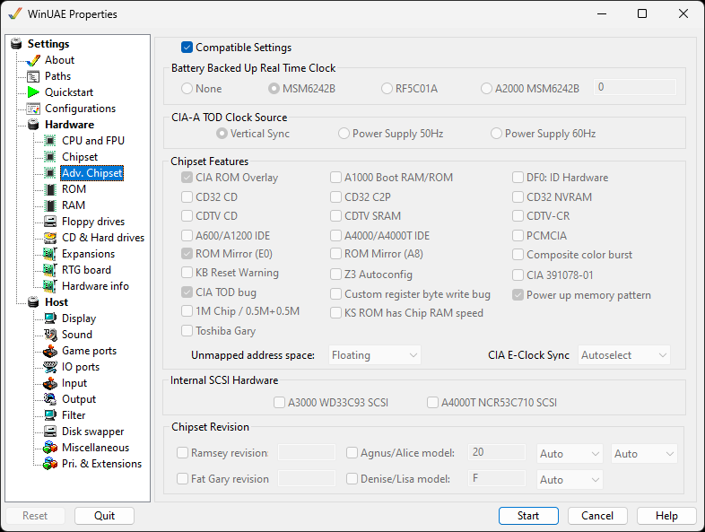

# Advanced Chipset

This page allows you to set advanced parameters for the
[Custom
Chipset](../background/custchips.md).

{ .center }

**Compatible Settings** - removing the check
will enable changing options on this page. It should be left
checked, as the settings are for advanced users.

## Battery Backed Up Read Time Clock

Configures the clock type used in the Amiga or a custom
clock. The RF5C01A is used in the A1200.

## CIA-A TOD Clock Source

These options allow changing the TOD (Time Of Day) clock
source for CIA-A (Complex Interface Adapter A) chip.  
The Amiga 500 used the Vertical Sync as signal for the real
time clock, which is not precise. It is the default setting for
compatibility reasons.

## Chipset Features

**CIA ROM Overlay** - CIA/Gayle overlay
emulation.  
**A1000 Boot RAM/ROM** - This is enabled when
8/64K ROM is used in the A1000.  
**DF0: ID Hardware** - No ID is used if DF0: is a
3.5" Double Density drive.  
**CD32 CD** - Enable use of CD32 custom CD
drive.  
**CD32 C2P** - Enable use of CD32's Chunky to
Planar graphics modes.  
**CD32 NVRAM** - Enable use of CD32's Non-Volatile
RAM for saving games etc.  
**CDTV CD** - Enable use of the CDTV (Commodore
Dynamic Total Vision) custom CD drive.  
**CDTV SRAM** - Enable use of CDTV's Static
RAM.  
**CDTV-CR** - Enable CDTV Cost Reduced or Mk II
version (CDTV based on A600 rather than A500)  
**A600/A1200 IDE** - Enable use of the Amiga 600
or 1200 internal IDE port.  
**A4000/A4000T IDE** - Enable use of the Amiga
4000 or 4000T internal IDE port(s).  
**PCMCIA** - Enable use of PCMCIA port featured on
the A600/A1200. Useful for external memory, storage and other
uses.  
**ROM Mirror (E0)** - 1 MB ROM image support.  
**ROM Mirror (A8)** - 2 MB ROM image support.  
**Composite color burst** Use analog video,
composite video signal generated by a video-signal generator
for color TV.  
**KB Reset Warning** - Keyboard reset warning.  
**Z3 Autoconfig** - Enable Zorro3
Autoconfiguration.  
**CIA 391078-01** - Enable Complex Interface
Adapter 391078-01 chip which has a bug in IO port output mode,
reading output mode port will always read output mode data
state.  
**CIA TOD Bug** Emulate the Complex Interface
Adapter (CIA) Time of Day bug.  
**Custom register byte write bug** - Enable a
custom register byte write bug feature.  
**Power up memory pattern** - Chip and Slow RAM
power up pattern emulation.  
**1MB Chip / 0.5M+0.5M** Enable 1MB Chip RAM made
of two 512KB chips.  
**KS ROM has Chip RAM speed** Set speed of
Kickstart ROM to Chip RAM speed.  
**Power up memory pattern** Chip RAM and Slow RAM
power up pattern emulation, enabled by default.  
**Toshiba Gary** - Optional Toshiba Gary (Gate
Array) slow (chip ram like) Z2 IO.Gary looks after bus control
and functions for floppy drivers.  
**Unmapped address space** Set unmapped address
space to Floating, all zeros or all ones.  
**CIA E-Clock Sync** - Set to AutoSelect, 68000,
Gayle or 68000 Alternate.

## Internal SCSI Hardware

**A3000 WD33C93 SCSI** - Emulate the A3000
Western Digital 33C93 SCSI controller.  
**A4000T NCR53C710 SCSI** - Emulate the A4000T NCR
53C710 SCSI controller.

## Chipset Revision

**Ramsey revision** - Specify the specific
version of the Ramsey chip (default is 0F). This is the gate
array Dynamic-static RAM controller.  
**Fat Gary revision** - Specify the specific
version of the Fat Gary chip (default is 00). This is the gate
array system address decoding chip.  
**Agnus/Alice revision** - Specify the specific
version of the Agnus/Alice chip (default is 21). Memory: Auto,
512K, 1M, or 2M.  
**Denise/Lisa revision** - Specify the specific
version of the Denise/Lisa chip (default is F). This is the
graphics chip. Type: Auto, Velvet, A1000-No EHB, or A1000.
