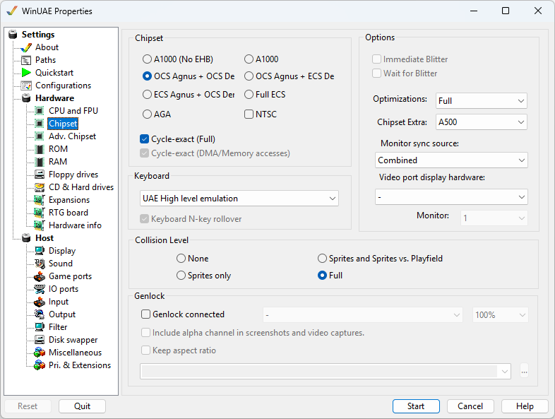

# Chipset

This will select which [Custom Chipset](../background/custchips.md) to use for
emulation.

{ .center }

## Chipset

- **A1000 (NoEHB)**: First Amiga A1000 with
  OCS chipset but no Extra Half Bright mode.
- **A1000:** A1000 with OCS chipset.
- **OCS Agnus + OCS Denise**: This was the
  first or original chipset, used in the Amiga : Agnus 512M,
  Denise (32 color graphics, HAM mode).
- **OCS Agnus + ECS Denise**: This is mixed
  chipset, used in the Amiga : Agnus 512M/1M, ECS Denise (Prod
  VGA, SuperHiRes modes)
- **ECS Agnus + OCS Denise:** Uses enhanced Fat
  [Agnus](../background/custchips.md) which
  supplies 1MB of Chip RAM and original Denise graphics chip.
- **Full ECS**: This was the next generation
  of Amiga chipsets. Compared to OCS, they provided higher
  resolutions, but no expansion of the color palette.
- **AGA**: This is the latest and most
  advanced chipset with 256 colors, HAM-8 mode (262K
  colors).  
  **NOTE:** AGA modes do not work with 8-bit color
  depth screen modes

**NTSC** Enables US NTSC screen mode (200
lines). The default is PAL (256 lines).  

**Cycle-exact** Enables cycle exact chipsets as
the real hardware for some games.  
**Cycle-exact (DMA/Memory accesses).** Enables
cycle exact chipsets just for Direct Memory Accesses or normal
memory accesses.  

**Chipset extra:** List of Amiga models to choose
to select appropriate chipset automatically.

## Options

**Keyboard connected** Sets whether a keyboard
is connected to the machine  
**Subpixel display emulation** Support
hires/superhires pixel positioning and borderblank horizontal
hires pixel offset fully emulated. Requires more CPU power.  
**Immediate Blitter** Does requested [blits](../background/custchips.md) immediately.  
**Wait for Blitter** Wait for the Blitter to
complete operations.  

**Monitor sync source** Selection of Combined,
Composite Sync or H/V Sync.  
**Video port display hardware** Selection of
Autodetect, A2024, Graffiti, Black Belt systems HAM-E, HAM-E
Plus, Video DAC 18, AVideo 12 or 24, Firecracker 24, DCTV,
OpalVision or ColorBurst.  
**Monitor.** Multi-monitor selection (default: 1
of 1-4).

## Collision Level

- **None** No collision detection used.
- **Sprites Only** Collision detection between
  sprites only enabled.
- **Sprites and Sprites vs Playfield**
  Collision detection between Sprites and background
  graphics.
- **Full** enables all levels of collision
  detection.  

  **HINT:** Full is not recommended because it
  causes unnecessary performance loss, and it is just very
  rarely needed.

## Genlock

**Genlock connected** Specifies whether a
Genlock (generator locking) device is connected. A Genlock is
used where the video output of one source, or a specific
reference signal from a signal generator, is used to
synchronize other television picture sources together.  
**Genlock type** Specified type of Genlock: Noise,
Test card, image file, Video file, Capture device, American
Laser Games LaserDisc Player, Sony LaserDisc Player, Pioneer
LaserDisc Player.  
**Percentage** of lock between sources.  
**Include alpha channel in screenshots and video
captures.**  
**Keep aspect ratio** Keep source width and
height.  
**Genlock file** Image file or video file to
use.
