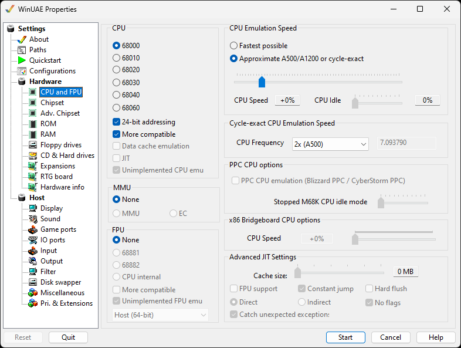

# CPU and FPU

These settings control the type of processor to
emulate.

{ .center }

## CPU

Choose between the classic Motorola processors:

- **68000** is the basic CPU type, as found in
  the Amiga 500, 1000, and 2000 models.
- **68010** is a slightly more advanced 68K
  member, but never actually shipped in a real Amiga.
- **68020** is a much more advanced 68K CPU,
  with some new instructions, and it has a fully 32-bit engine.
  Used in the A2500 for brief period on the A2520 card. If 24
  bit addressing is enabled, it is the same as the 68EC020 chip
  in the A1200.
- **68030** This is a mid range CPU used in
  the A3000 and the low end A4000s.
- **68040** is the top CPU provided with the
  A4000 desktop computer.
- **68060** is the top end CPU mainly provided
  on accelerator cards and the A4000T. It requires the
  68060.library installed before using.

**24 bit addressing** is used mainly by the
**68EC020** CPU such as the A1200.  
**More compatible** is only available when the CPU
type is a **68000**. Some games and demos require
this setting for proper compatibility.  
**Data cache emulation** Besides the instruction
cache, you can also emulate the data cache on the CPU.  
**JIT** can be enabled to access the Advanced Just
In Time settings if the 68030 or better is selected (see
below).  
**68040 MMU** enables the Memory Management Unit
of the 68040 for operating systems like Linux on the Amiga. It
is not compatible with JIT.  
**Unimplemented CPU emu** emulates the full 68060
CPU (in case you forget to load Setpatch and 68040.library and
68060.library).

## FPU (Floating Point Unit)

- **None** No FPU is provided, this is the
  only option for the 68000 and 68010.
- **68881** Can be specified with the 68020
  and 68030.
- **68882** Can be specified with the 68020
  and 68030.
- **CPU internal** Can be specified for the
  68040 and 68060.

**More Compatible** is available if a FPU is
selected. Some applications require this for proper
compatibility.  
**Unimplemented FPU emu** emulates the full 68881
FPU (in case you forget to load Setpatch and 68040.library and
68060.library).  
**Host** FPU precision size: 64 bit, 80 bit or
Soft float (80 bit).

## CPU Emulation Speed

- **Fastest possible** lets the CPU section of
  the emulation run as many cycles as possible, while still
  maintaining emulation of the custom chips at the appropriate
  rate. It is important to keep sound and graphics
  synchronized, no matter how fast the PC is
- **Approximate A500/A1200 or cycle exact**
  limits the CPU emulation to run the same number of cycles per
  vertical-blank as a standard A500 or A1200 would. In other
  words, for every 50Hz refresh of the graphics, the same
  number of CPU instructions will be executed as on a real A500
  or A1200 computer.

**CPU Speed** lets you tweak the balance of
power between custom-chip emulation, and CPU speed. Some games
and demos require this setting to be adjusted. This setting is
the only CPU setting which can be changed once WinUAE is
running.  
**CPU Idle** You can adjust the idle status of the
CPU with this slider. This feature can be useful on notebooks
to save battery.

## Cycle-Exact CPU Emulation Speed

**CPU Frequency** will change the frequency
multiplies for the CPU

## PPC CPU Settings

**PPC CPU Emulation (Blizzard PPC / Cyberstorm
PPC)** Enables the PPC emulation; A separate plugin is
required - see [Expansions](expansions.md).  
**Stopped M68K CPU idle mode** Sets level of idle
mode for the 680x0 processor

## x86 Bridgeboard CPU options

**CPU Speed** set between 0 and 100% CPU speed
of the bridge to a x86 board

## JIT (Just in time) Settings

Due to the importance of the JIT engine and its complexity,
it has its own [page](../emulation/jit.md) where
you will find a description of its possibilities.
