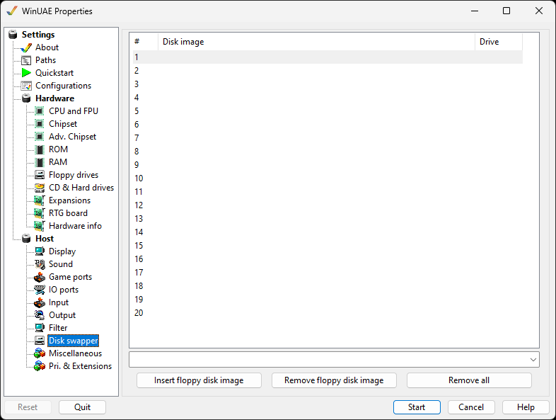

# Disk Swapper

The disk swapper mechanism is similar in concept to a
playlist or a CD changer: up to 20 disk images can be added to
a list for swapping them quickly.

{ .center }

Double clicking on a line or selecting it and choosing
**Insert floppy disk image** will bring up a file
picker to add an ADF image to the list. All slots may be filled
with images.  
Clicking in the **Drive** column next to each
entry will cycle through all enabled floppy drives. Once the
disks have a drive name next to them, they will appear in the
appropriate [Floppy Drives](floppies.md) slots.  

Selecting an entry and clicking **Remove floppy disk
image** will remove the image from the list.  
Use **Remove all** to remove all the images from
the list.
