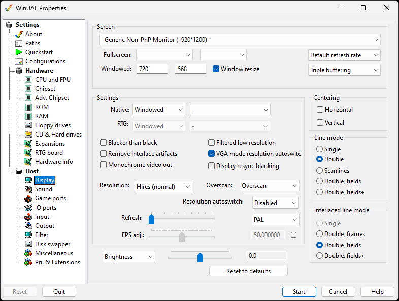

# Display

These settings allow you to choose how WinUAE will display
your Amiga-generated graphics.

{ .center }

## Screen

**Primary Display driver** Here, you can select
which screen or graphics card you can display your Amiga screen
on, useful if you have multiple monitors connected to your
system.  
**Fullscreen** sets the full screen resolution
(see Settings), color depth and the Frequency (usually set to
screen Default).  
**Windowed** This lets you change the resolution
used for the Amiga displayed in a Window on the PC screen.  
**Window resize** allows window to be resized
after starting emulation. *Hint:* to keep the aspect
ratio, press CTRL while resizing the window.  
**Refresh rate** can be set to default, 56Hz, 60Hz
NTSC, 72Hz or 75Hz.  
**Buffering**. Select type of buffering required:
No buffering, double or triple buffering.

## Settings

**Native** Windowed, Fullscreen or Full-Window
with VSync setting.  
**RTG** Windowed, Fullscreen or Full-Window with
VSync setting.

**Blacker than black**  
**Remove interlace artifacts**  
**Monochrome video out**  
**Filtered Low Resolution** will fix incorrect
colors used in games that use the super hires trick.  
**VGA mode Resolution Autoswitch**  
**Display resync blanking**  
**Resolution** can be set to Lores, Hires or Super
Hires.  
**Overscan** can be set to TV (narrow, standard or
wide), Overscan, Overscan+ or Extreme.  
**Resolution autoswitch** can be disabled, always
on, 10%, 33% or 66%.  
**Refresh rate** will set how often the screen
will be updated. Useful on slower PCs or graphics cards.  
**PAL** or **NTSC** to set the video
out mode  
**FPS adj** is used to adjust the Frames per
Second to the display to speed up or slow down the display
(default is 50 fps)

**Brightness** levels can be set for the
correct display set up (-200 to 200).  
**Reset to defaults** is used to update brightness
settings back to defaults.

## Centering

Checking the boxes will cause the Amiga output to be
centered on the configured screen

## Line mode

- **Single** draws every line once.
- **Double** draws every line twice. This
  allows interlace mode to be emulated nicely, but of course
  you also need a display that is twice as high.
- **Scanlines** will not draw certain lines,
  leaving them black.
- **Double, frames or fields [+]**

## Interlaced line mode

Line mode when output is interlaced.
