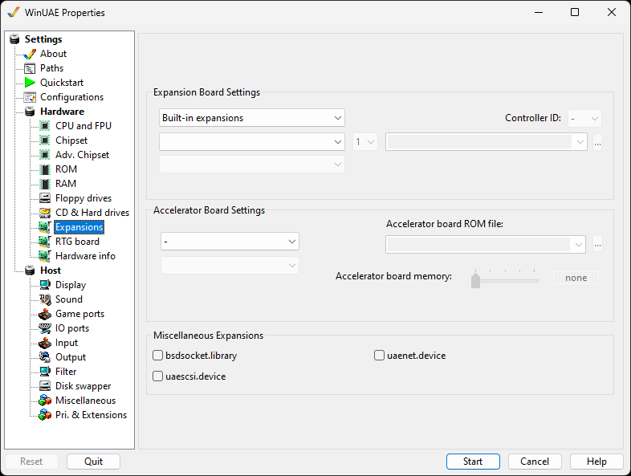

# Expansions

This will change settings for expansion cards such as RTG,
Network, and SCSI cards.

{ .center }

## Expansion Board Settings

**Controller or Bridgeboard selection** for
Built-in, SCSI, IDE, SASI, Custom, PCI, x86 Bridgeboards,
Graphics, Sound, Network or Disk boards.  
**Controller model selection** for the make and
model of required controller or bridgeboard. Click
**Enabled** to enable/disable this controller
selection.  
**Controller series selection** for controllers in
the same series.  
**SCSI Controller ID:** Specify a SCSI controller
ID (0-7).  
**SCSI/IDE/Boot ROM file.** allow you to specify a
expansion card and ROM file and model. Upto 4 separate files
can be selected.

## Accelerator Board Settings

**Accelerator make selection.** Select ACT,
Commodore, DKB, GVP, Kupke, Macrosystem, M-Tec, Phase 5, RCS,
Interactive Video makes.  
**Accelerator board selection.** Select the actual
accelerator board.  
**Accelerator board ROM file**. Select the
Blizzard PPC or Cyberstorm accelerator board ROMs.  
**Accelerator board memory** amount of memory for
the board (0-256 MB). This is kept in sync with the
matching memory size on the [RAM](ram.md) page.

## Miscellaneous Expansions

**bsdsocket.library** Allows the Amiga to use
the network connection of the host.  
**uaescsi.device** Adds support for IDE/SCSI
CD-ROM drives on the Amiga side.  
**uaenet.device** Enable SANA2 compatible network
devices. Requires [WinPCap](../links.md#essential)
(Windows Packet Capture Library).
