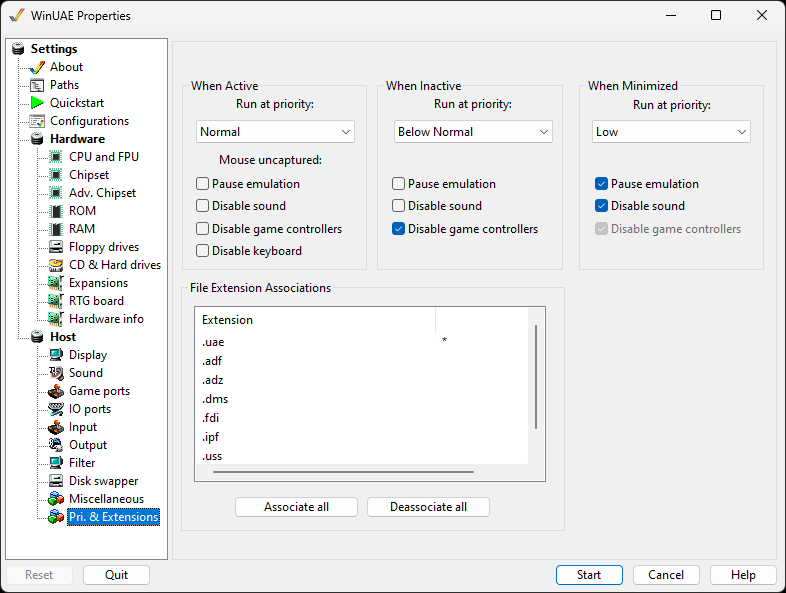

# Pri. & Extensions

{ .center }

## When Active

**Run at priority** Choose which priority
WinUAE should have when it's window is active. Depending on
which other programs are running on the host, this should be
set to Normal or higher.  
**Pause emulation** Pause the emulation if mouse
is uncaptured.  
**Disabled sound** Disable the sound if mouse is
uncaptured.  
**Disable game controllers** Disable any game
controllers if mouse is uncaptured.  
**Disable keyboard** Disable the keyboard if mouse
if mouse is uncaptured.

## When Inactive

**Run at priority** Choose which priority
WinUAE should have when it's window is in the background. To
save processing time, this should be set to Below Normal or
lower.  
**Pause emulation** will completely halt
emulation  
**Disable sound** turns off audio
output**  
Disable game controllers** will disable inputs from game
controllers

## When Minimized

These options are identical to the ones in the Inactive
section, but they only apply when the window has been
minimized, and isn't just in the background.

## File Extension Associations

File associations enable double click functionality in
Windows, and can be changed by either double clicking an entry
in the list or using the **Associate all** and
**Disassociate all** buttons. An asterisk
indicates that the file extension is associated with
WinUAE.  

These extensions are known by WinUAE:

| Extension | Explanation |
| --- | --- |
| uae | Configuration file for WinUAE |
| adf | Amiga disk format image |
| adz | Amiga disk format image compressed |
| dms | Disk masher format image |
| fdi | Floppy disk image |
| ipf | Image preservation format |
| uss | UAE save state file |
