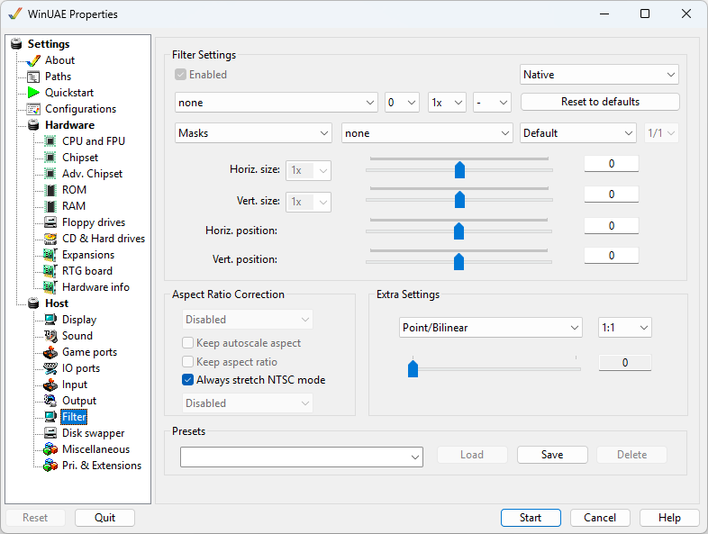

# Filter

In this section, filters can be applied to the graphics
output, useful for example in games with limited
resolutions.

{ .center }

## Filter Settings

Set to either **Native**, **Native
(Interlaced)** or **RTG** mode.  
You can specify whether to use **Null Filter, Direct3D,
OpenGL, Scale2X, hq2x, SuperEagle, Super2XSal, 2xSal**
or **PAL** graphics support with
**Point** or **Bilinear** graphics in
either 16 or 32 bit modes.  
The **Horizontal and Vertical Sizes** can be
specified from -50 to 50 or 1x to 8x if using filters except
Direct3D or OpenGL.  
The **Horizontal and Vertical Positions** can be
specified from -50 to 50.

## Aspect Ratio Correction

You can specify the aspect ratio such as Disabled,
Automatic, 4:3, 5:4, 15:9, 16:9, 16:10.  
**Keep autoscale aspect** ensures that any filter
will ensure display keeps its autoscale ratio correct to avoid
distortions.  
**Keep aspect ratio** ensures that any filter will
ensure display keeps its aspect ratio correct to avoid
distortions.  
**Monitor type** can be Disabled, VGA or TV.  
**Always stretch NTSC mode** expands the NTSC mode
to fit the window or screen.

## Extra Settings

**Point/Bilinear** can be specified, and ratios
from 1:1 to 3:3 and from slider from 0 to 1.  
**Scanline** can be specified as Scanline opacity,
level or offset and ratios from 1:1 to 3:3.  
**Scanline Brightness** can be specified from 0 to
100.

## Presets

Filter settings can be saved as a **Preset** if
you wish to reuse Filter settings in other configurations.  
Previous saved settings can be **Load**ed or
**Deleted,** if not required.
