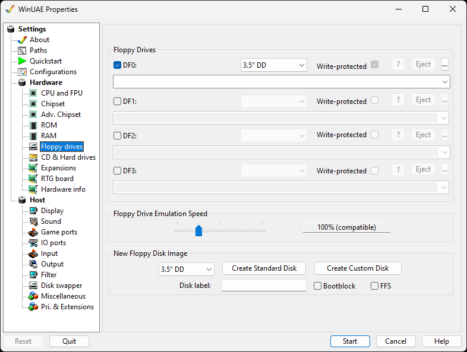

# Floppy Drives

Using this tab, you can "insert" disks into your virtual
Amiga, and adjust floppy speeds.

{ .center }

## General

Up to 4 floppy drives can be enabled via the check marks and
will then be usable in the emulation.  
Enable the **Write Protected** option to emulate
the write protect tab on your disk images.  
**Disable** will disable the drive and free up
some memory (vital for old games). Note that
**DF0** is the default drive to boot from, so
please use this before other drives.  
**Eject** removes the disk from the drive.  
**...** buttons will show a file picker to insert
a disk image.

## Floppy Drive Emulation Speed

The slider will allows changing the emulated disk access
speed, from **Turbo, 100%, 200%, 400% or 800%**.
**Turbo**-floppy speed enables fast writing, and
uses the maximum transfer rate from the media that the floppy
image is accessed from, i.e. the host hard disk.

## New Floppy Disk Image

**Disk image size.** 3.5" DD = 800KB, 3.5" HD =
1.76MB, 3.5" DD (PC) = 720kB, 3.5" HD (PC) = 1.44MB, 5.25" SD =
440kB.  
**Create Standard "Floppy"** creates a blank
ADF.  
**Create Custom "Floppy"** allows you to create a
special ADF file for saving games onto if the Standard floppy
does not work.  
**Disk Label** will label the new disk image
without having to in Workbench.  
**Bootblock** will make the disk bootable.  
**FFS** will format the disk using the Fast File
System.
