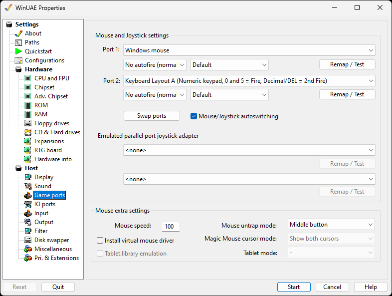

# Game Ports

These settings let you control how joystick support is
provided in WinUAE, as well as choosing serial and parallel
port emulations.

{ .center }

## Mouse and Joystick settings

With these 2 options you can select the configuration of the
"Amiga" - ports. Port 0 is usually used by the Amiga - mouse.
It is easy to exchange the settings with the swap button.  
**Mouse \*** uses DirectInput to control the mouse,
**Windows Mouse** uses the windows desktop mouse
and **Mousehack mouse** is for
**Tablet** users. **X-Arcade** is for
Joystick with built in key mappings.  
For either port you can select a Mouse, an X-Arcade device, a
pre-defined Keyboard layout or a joystick if it is installed
and connected to your PC.  
If you move your mouse over **X-Arcade layout
information**, you can view the buttons and so on and
what keys they are mapped to.  
For the **Parallel port joystick adapter**you can
select an X-Arcade device, Keyboard layout or other installed
joystick.  
Use the **Remap** button for an easy way to remap
directions and buttons for the device.  
Press **F12** to exit remap or test modes. Press
**F11** to skip an event in the window.

## **Mouse extra settings**

Mouse speed controls the speed of the mouse pointer across
the screen. 100 is max speed, 50 is half speed etc.  
Magic mouse allows you to move Amiga mouse outside borders
(requires. HD installation, window mode using Picasso96).  
A Virtual mouse driver can be installed for other features.  
Cursor mode can be Show both cursors, show native cursor only
or show host cursor only.  
Full tablet input emulation and the tablet.library emulation
can be used to emulate the alternative tablet devices for input
control.
