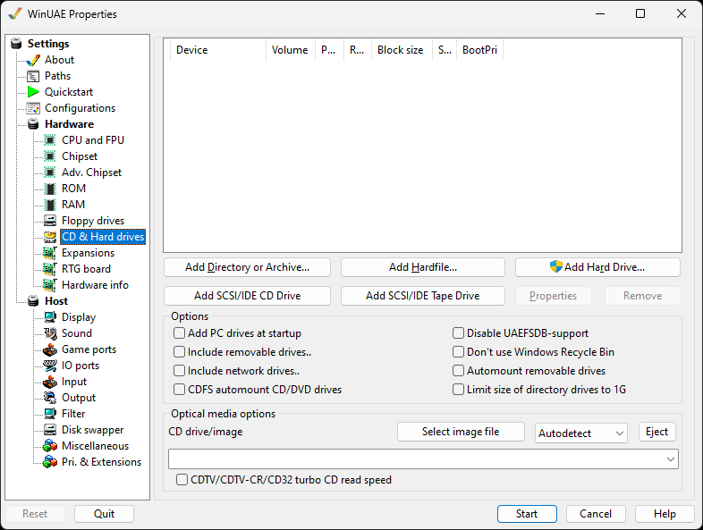
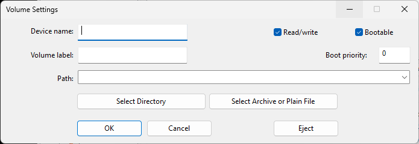
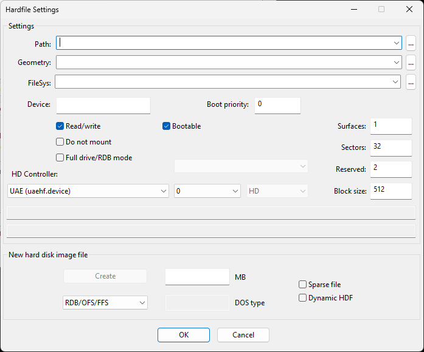
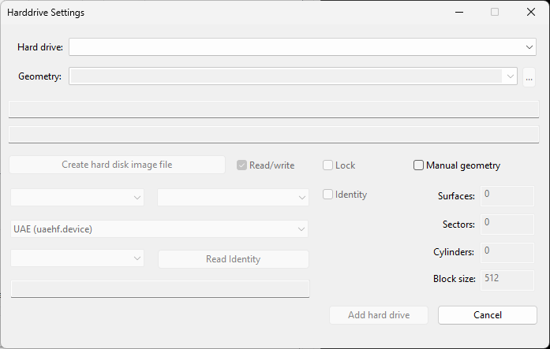
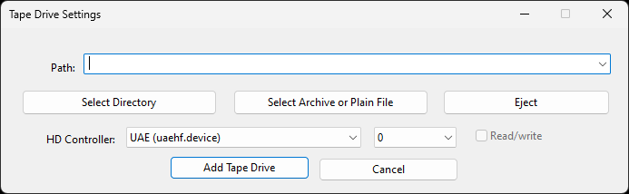

# Hard Drives

This tab contains some very important and complex options,
please make sure to read the [Drive Emulation](../emulation/drives.md) page for
details!

{ .center }

## Add Directory or Archive...

{ .center }

Adds a directory or an archive on the host as virtual HDD to
the Amiga. You can specify a path to your desired folder in
Windows, set a Volume and a Device name.  
Use **Select Archive or plain file** to add an
archive file (.zip, .7z, .rar, .lha, .lzh, .lzx) to appear as a
disk on Workbench so there is no need to extract the files
first.

## Add Hardfile...

{ .center }

### Settings

Add a hardfile; if you want to use an existing file, just
click the ... button opposite **Path** and select
the hdf file. If you want to add a new file, skip over to "New
hard disk image file".  

**HD Controller** changes which controller to use
such as **UAE, IDE, SCSI, PCMCIA SRAM or
IDE**.  
Once you have selected a hardfile, it will display details
about the cylinders, blocks, size and DOS type in the box.  
Settings:  
**Full drive/RDB mode** enables Rigid Disk Block
mode, this stores the partition and file system information in
a special block of disk (similar to the Master Boot Record on
PCs).

### New hard disk image file

**RDB/OFS/FFS** - Set file system to Rigid Disk
Block mode, Original File System (WB 1.3) or Fast File System
(WB 2.x, 3.x). Newer file systems include PFS3 (Professional
Filing System), PDS3, SFS (Smart File System) and Custom file
system.  
**DOS type -** Displays the file system name in
Hexadecimal format.  
**Sparse file** - Formats disk file as a file
which attempts to use disk space more efficiently when it is
mostly empty by using metadata to represent empty space.  
**Dynamic HDF** - Modern disk file format which
expands as more data is added to the disk file, minimizes disk
usage like Dynamic VHD files on PC.

## Add Hard Drive...

{ .center }

It is also possible to add actual, full hard drives to
WinUAE. The drop down list will only show Amiga formatted
drives, Amithlon partitions and empty partitions (no Windows
partitions). Tick the **Read/Write** option if you
wish to read and write to such a partition. The boxes below
will display details about the hard drive selected, such as
size. You can select the device used (uaehd.device). Manual
some drives you can select Manual geometry for Surfaces,
Sectors, Cylinders and Block size.  
**NOTE:** Administrator rights are required for
this feature!

## Add SCSI/IDE Tape Drive...

{ .center }

Select a Path to a folder where data can be read or written
to. It will work with Amix and any backup software that
requires a tape drive.  
**Select directory** Browse for an directory on
hard disk to emulate tape drive.  
**Select archive or plain file** Browse for an
archive or normal backup file.  
**Eject** Remove the tape from the drive.  
**HD Controller**Specify controller to emulate
e.g. UAE, IDE, SCSI, PCMCIA SRAM, PCMCIA IDE.  
**Read / write** Enable read and write mode for
tape drive otherwise it will use Read only mode.  
**Add Tape Drive** will add the new emulated tape
drive to the Hard drive list.

## Options

**Add PC Drives at Startup** mounts all
available fixed drives for the Amiga to use  
**Include removable drives** also mounts all
removable drives, such as CD-ROM, USB drives, SD cards  
**Include network drives** also mounts all mapped
network drives  
**Disable CDFS automount CD/DVD drives** will
disable mounting compact discs and DVDS without having to
install a CD file system  
**Disable UAEFSDB Support** disable creating
UAEFSDB files when a directory is mounted as drive  
**Don't use Windows Recycle Bin** - Excludes
Windows Recycle Bin from emulation.  
**Automount Removable drives** will mount a
removable drive such as soon as the media is inserted  
**Limit size of directory drives to 1GB** will do
just that

## Optical media options

Similar to virtual floppies, a CD image can be inserted or
injected in this section.  
**CDTV/CDTV-CR/CD32 turbo CD read speed** will
emulate the CD drive at maximum speed
