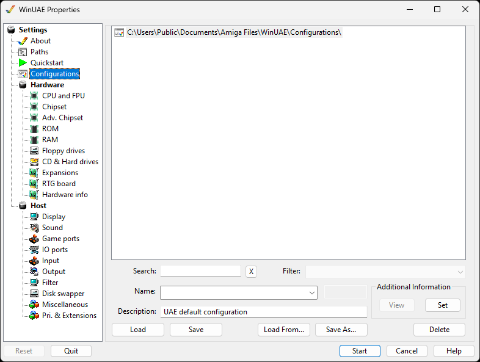

# Hardware

The Hardware section contains all settings for the emulated
Amiga hardware.

{ .center }

## Subsections

- [CPU and FPU](cpu.md)
- [Chipset](chipset.md)
- [Adv. Chipset](advchipset.md)
- [ROM](rom.md)
- [RAM](ram.md)
- [Floppy Drives](floppies.md)
- [CD & Hard Drives](harddrives.md)
- [Expansions](expansions.md)
- [RTG board](rtgboard.md)
- [Hardware info](hardwareinfo.md)
