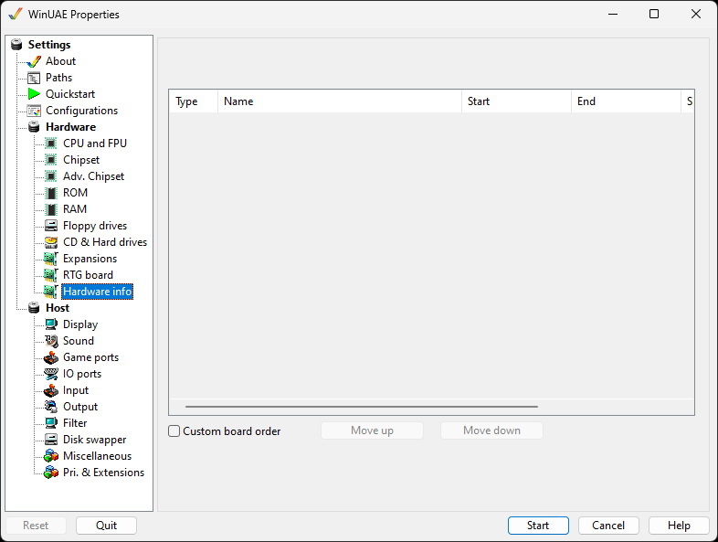

# Hardware Info

{ .center }

A list of hardware attached to the emulator once the
configuration is defined. For example, it will list disk
interfaces (IDE or SCSI), ROMs used, RAM used, graphics cards,
accelerator boards, and others.

**Type** is the interface type. Z2 = Zorro 2,
Z3 = Zorro 3  
**Name** name of the hardware  
**Start** starting memory address of the
device  
**Size** memory size used  
**ID** ID number used by AutoConfig.  

**Custom board order** changes the order of the
devices.  
Once enabled, selecting an entry and pressing **Move
up** or **Move down** will change the
items' position on the list.
