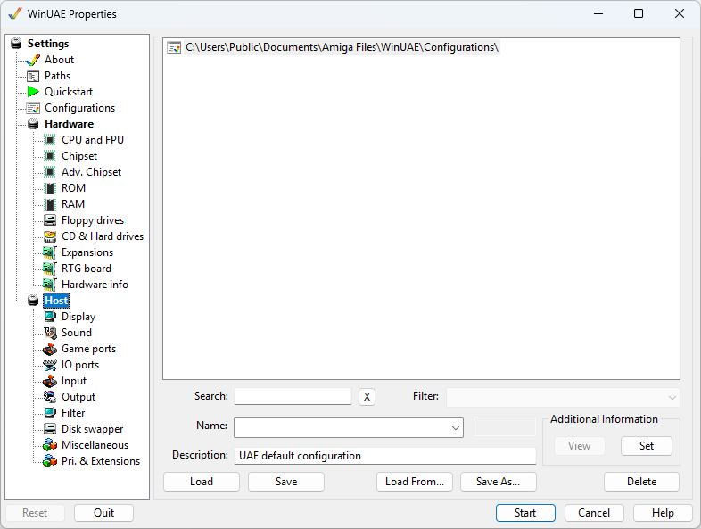

# Host

{ .center }

The Host section contains all host related settings.

## Subsections

- [Display](display.md)
- [Sound](sound.md)
- [Game Ports](gameports.md)
- [IO Ports](ports.md)
- [Input](input.md)
- [Output](output.md)
- [Filter](filter.md)
- [Disk Swapper](diskswapper.md)
- [Miscellaneous](misc.md)
- [Pri. & Extensions](extensions.md)
