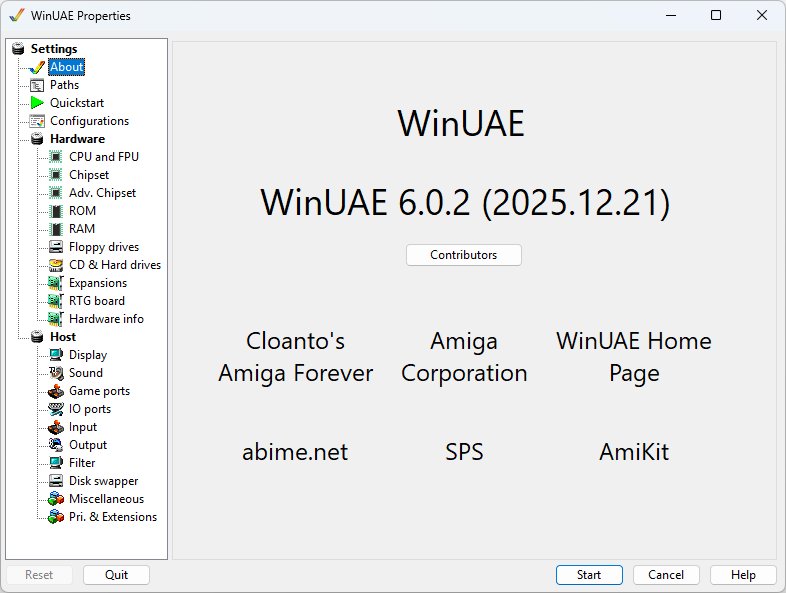

# The GUI

WinUAE includes a powerful and fairly complicated Graphical
User Interface to manage the various settings and abilities of
the virtual Amiga. This section contains descriptions of those
settings.

{ .center }

## Subsections

- [Paths](paths.md)
- [Quickstart](quickstart.md)
- [Configurations](configurations.md)
- [Hardware](hardware.md)
- [Host](host.md)
