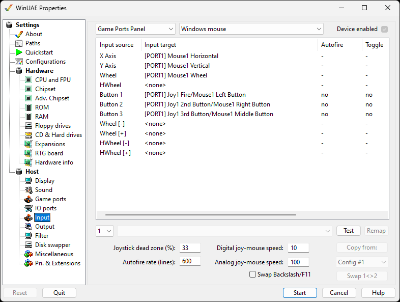

# Input

You can configure your Input device such as Joysticks to
match your requirements for games or other
software:

{ .center }

You can specify **Compatibility mode** with
standard Windows setup or specify up to 4 configurable settings
yourself. For each **Input Source** you can
configure each **Input Target** using options from
the drop down menu. For example you can specify whether it's a
Joystick, Mouse, Keyboard, Lightpen, Lightgun or Parallel
Joystick or whether it's a Horizontal, Vertical, Button or
direction.  
Clicking on entries in each of these columns will alter the
setting:  

- **Autofire** toggles autofire on and
  off
- **Toggle** switches the toggle on and
  off
- **Invert** toggles inversion on and off
- **Qualifiers** allows choosing qualifiers,
  i.e. additional buttons that have to be pressed to
  activate

**Test** is used to test the new input
configuration. Press F12 to exit test mode or F11 to skip the
current event in remap mode.  
**Remap** allows changing what the input will
do  
**Joystick dead zone** can be specified for a
percentage of the Joystick's movement to prevent unwanted
movement.  
**Autofire rate (frames)** specifies how often
firing occurs over a number of frames, if enabled.  
**Digital joy-mouse speed** can be specified for
how fast response is for digital input devices (e.g. USB).  
**Analog joy-mouse speed** can be specified for
how fast response is for analogue input devices (e.g. MIDI
port).  
**Swap Backslash/F11** allows swapping these keys
for compatibility.  
**Copy from** option allows you to copy a
configuration from another configuration into the current
configuration to save time.  
**Swap 1&lt;>2** button allows you to swap
between joystick/mouse ports.
