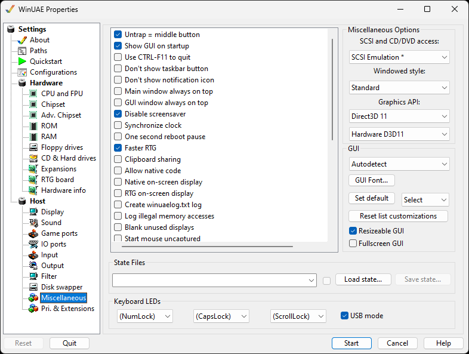

# Misc

Advanced settings which do not fit into other
categories.

{ .center }

## Advanced

**Untrap** = **Middle Button**
allows the middle button on your mouse to act like ALT-TAB,
switching focus away from the WinUAE emulation. This is useful
because WinUAE traps the mouse-cursor within its Window
borders, and if your hand is already on the mouse and you want
to escape this capture, you can just press the middle
button.  
**Show GUI on startup** will allow you to
double-click a .uae [configuration](configurations.md) file without it
immediately launching the emulation.  
**Use CTRL-F11 to quit** Just press this key
combination to quit WinUAE. If this option is enabled, the
ALT-F4 combination can be used by the Amiga properly, and
CTRL-F11 will quit WinUAE.  
**Don't show taskbar button** Removes the taskbar
button.  
**Don't show notification icon** Removes the
WinUAE icon from the notification area.  
**Main window always on top** Make sure WinUAE
window is always on top of other windows.  
**GUI window always on top**. Make sure the GUI
window is always on top of the windows.  
**Disable screensaver** Temporarily stops screen
saver feature for the display when using WinUAE  
**Synchronize clock** Synchronizes Amiga [clock](advchipset.md) with the PC clock.  
**One second reboot pause** introduces a short
pause before a reboot.  
**Faster RTG.** Disables non needed emulation
features such as internal bitplace emulation and copper, when
[RTG](rtgboard.md) (P96) is in use.  
**Clipboard sharing** allows you to share the
contents of your clipboard between the Amiga and Windows if
enabled.  
**Allow Native code** is disabled by default.
Context switching between native or emulated code (PPC/
68k)  
**Native on-screen display** overrides Display
setting to use only native screen modes.  
**RTG on-screen display** overrides Display
setting to use only [RTG](rtgboard.md) screen
modes.  
**Create winuaelog.txt log** can be enabled to
debug WinUAE when experiencing problems (see [Paths](paths.md) for more settings)  
**Log illegal memory accesses** can be enabled to
debug memory access to protected or unallocated memory
areas.  
**Blank unused displays** opens full screen
topmost black window(s) option.  
**Start mouse uncaptured**. Start WinUAE but do
not capture mouse pointer in WinUAE window.  
**Start minimized.** Minimize WinUAE window when
WinUAE is started.  
**Minimize when focus is lost** will minimize the
WinUAE window if you switch to another program or window.  
**Black frame insertion** is supported in variable
refresh modes.  
**Master floppy write protection** overrides write
protection on the [Floppy](floppies.md) drives
window, so you can't accidentally untick it.  
**Master harddrive write protection** overrides
write protection on the Hard drives window, so you can't
accidentally untick it.  
**Hide all UAE autoconfig boards** will hide any
extra [Zorro](hardwareinfo.md) boards from the
emulator.  
**Right Control = Right Windows key**. Map the
Windows key to a Right Ctrl key for some keyboards.  
**Windows shutdown / logoff notification.**
Display WinUAE screen in Windows shutdown or logoff screen if
emulation session is active.  
**Warn when attempting to close window**. Display
a warning if window close is attempted.  
**Power led dims when audio filter is disabled**.
Dim the power light when audio filter is disabled (see [Sound](sound.md) tab).  
**Automatically capture mouse when window is
activated.** Saves having to capture mouse when swapping
windows to WinUAE.  
**Debug memory space** Debug accesses to memory
space (memwatch).  
**Force hard reset if CPU halted.** Ensures a full
hard reset when the CPU is halted.  
**A600/A1200/A4000 IDE scsi.device disable**
Disable onboard IDE scsi.device.  
**Warp mode reset** Auto switches off Warp mode
when running a program or KS ROM shows something.  
**GUI gamepad control** Allow control of the GUI
via a gamepad  
**Default on screen keyboard (Pad button 4)**
Allows disabling the default on screen keyboard mapping on the
pad  
Default mapping in the GUI:

| Button | Explanation |
| --- | --- |
| A | select or left mouse click |
| B | right mouse click |
| Y | Change active GUI area or TAB key |
| D-Pad | select UI elements |
| Left stick | Move (requires a XInput compatible pad) |

Pad button 4 is default mapped to open/close on screen
keyboard inuput event.  
Pad button/d-pad that normally controls Amiga Joystick moves
keyboard selection.

## Miscellaneous Options

**SCSI and CD/DVD access .** Select type
of [ASPI layer](harddrives.md) to use, e.g. SCSI
Emulation, SPTI, SPTI + SCSI Scan.  
**Windowed style.** Select the following styles:
Borderless, Minimal, Standard or Extended  
**Graphics API** to specify API to use for
graphics e.g. Direct3D 9, Direct3D 11 or DirectDraw.  
**DirectDraw** Specify type of ram for display
buffer system as Default RAM, Local VRAM, Non Local VRAM or
System RAM.  

## GUI

Specify the language used for WinUAE.
**Autodetect** will attempt to load the language
of the host system if it is available, or default to
English.  
**GUI Font.** Select a font for GUI, select a font
using Windows font selection window.  
**Set default.** Set the default font.  
**Select** font size from 60% to 140%.  
**Reset list customizations** sets all list
customizations back to defaults.  
**Resizable GUI** option to allow you expand or
shrink the WinUAE Window.  
**Fullscreen GUI** option to expand the WinUAE
window to fill the screen.  

## State Files

**Load State**. Loads a saved state from disk
into memory either as a USS, GZ or GZIP file.  
**Save State** Saves state of system and memory to
disk, to a USS file.  

## Keyboard LEDs

(NumLock) Sets which LED to emulate e.g. Power, HD, CD,
DFx  
(CapsLock) Set which LED to emulate e.g. Power, HD, CD, DFx  
(ScrollLock) Set whichLED to emulate e.g. Power, HD, CD,
DFx  
**USB-Mode** Add support for Multimedia
keyboards.  
