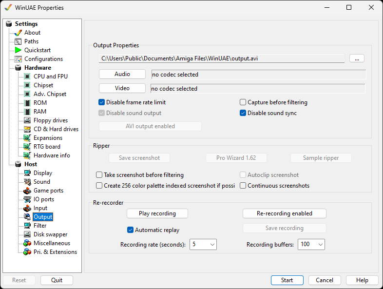

# Output

The Output tab allows you record video and
audio

{ .center }

## Output Properties

**Output** name of output file to save to.  
**Video** type of video codec used to
create/compress the video file.  
**Audio** type of audio codec used to
create/compress the audio data.  
**Disable frame rate limit** removes any limits
when recording certain types of screen  
**Disable sound output** - removes sound when
record videos if not required  
**Capture before filtering -** Capture audio or
video before filtering output  
**Disable sound sync** disables sound sync with
video  
**AVI output enabled** writes the output in Audio
Video Interleave (AVI) format

## Ripper

**Save screenshot** saves a snapshot of what's
on the screen while emulation is running. There are [Keyboard shortcuts](../emulation/keyboar.md) to accomplish
the same.  
**Pro Wizard** Rips music scores.  
**Sample ripper** will sample sounds.  

**Take screenshot before filtering** will capture
screen contents before any of the configured [filters](filter.md) have been applied.  
**Create 256 color palette index screenshot if
possible**  
**Autoclip screenshot** will trim the picture to
output format  
**Create 256 color palette index screenshot if
possible**  
**Continous screenshots** Screen shot taken on
every frame.

## Re-recorder

This can allow you to **Record** and
**Playback** recorder input events saved with
WinUAE. They are saved as **.inp** files.  
**Automatic replay** Allow auto-replay of the
recording.  
**Save recording** Save a recording to an .inp
file.  
**Recording rate** Set to 1 to 60 seconds.  
**Recording buffers** Set buffer from 50 to
10000.
