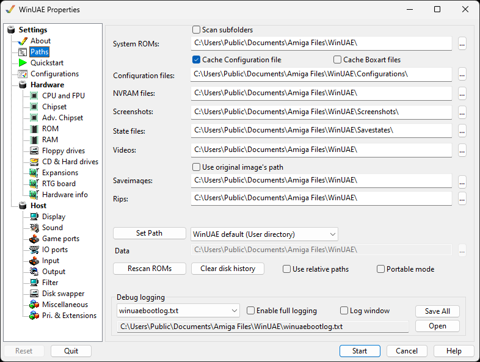

# Paths

Here are the default paths for where WinUAE will store
configurations, save states, logs and screenshots, but also
search for, ROMs. By default, WinUAE stores this in the public
documents folder.

{ .center }

**System ROMs** Location of [Kickstart ROMs](rom.md) needed to boot Amiga. Use
**Scan subfolders** to search subfolders for
ROMs.  
**Configuration files** Location of .uae [configuration](configurations.md) files for different
models or configurations of Amigas.  
**NVRAM files** Non-Volataile memory files.  
**Screenshots** Saves screenshots of the Amiga
screen, see the [Output](output.md) tab.  
**State files** Saves memory to a [state file](misc.md). Useful for saving game
positions.  
**Videos** Saves [video](output.md)
output to files here.  
**Use original image's path** Use the original
paths for images rather than the Saveimage image path.  
**Saveimages** Saves ADF floppy images here.  
**Rips** Saves music and sound ripped files
here.  
**Set Path** Resets changes to all paths back to
the AmigaForever, WinUAE defaults (User or EXE) or Custom
paths.  
**Data path** Path for Winuae data files.  
**Rescan ROMs** Look for Kickstart ROMs on hard
disk.  
**Clear disk history** Remove history of disks
used previously.  
**Use relative paths** Allows use of relative
paths to WinUAE program location for running via USB e.g.
.\Configurations, .\Screenshots, those will be relative to the
path where WinUAE.exe is located  
**Portable mode** will prevent settings to be
written to the system's registry

## Debug logging

**Debug logging** Name of the WinUAE boot log
file.  
**Enable full logging** Determines if a full
rather than a shorter log file is created.  
**Log window** Display log in a window.  
**Log path and file name** Full path to the log
name.  
**Save All** Saves the log file.  
**Open** Opens the current log file.
