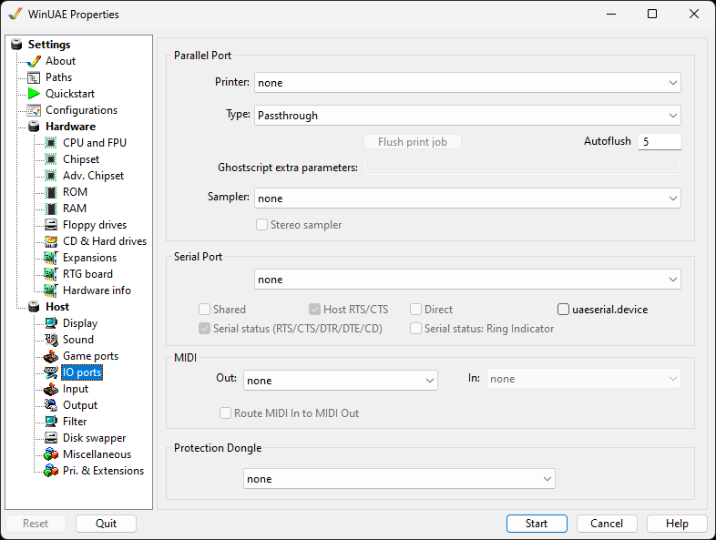

# I/O Ports

These settings let you control how parallel, serial and MIDI
port emulations work.

{ .center }

## Parallel Port

This lets you specify which PC installed printer you want to
use for printing on the Amiga side.  
**Type** can be ASCII-Only for text only printing,
Epson Matrix Printer Emulation for older dot matrix type
printers, The Postscript (Passthrough) for the postscript
language. NOTE: The Postscript printer emulator will use
Ghostscript.  
**Ghostscript extra parameters** are additional
command line parameters to open Ghostscript with.  
**Sampler** can be None or DSound.  
**Stereo sampler** is available if the sound
sampler has been selected.

## Serial Port

The drop down menu allows which host port to use. All ports
including virtual ports on your PC will be available.  
**Shared** will keep the port available for other
programs  
**RTS/CTS** handshaking can be enabled if it's
required for modems or similar devices  
**Direct** will fix PC to PC Lotus 2 serial link
problems  
**uaeserial.device** for access to different types
of serial ports if a program requires it including multiple
ports and unit numbers.  
**Serial Status** for handshake/status pin
emulation of RTS, CTS, DTS, DTR, DTE and CD modes.  
**Serial Status** for handshake/status pin
emulation of Ring Indicator.

## MIDI

**Out** specifies the MIDI output device  
**In** specifies the MIDI input device  
**Route MIDI in to MIDI Out** forwards all input
directly to the output device

## Protection Dongle

Using the drop down list, one of the supported dongle types
can be selected.
