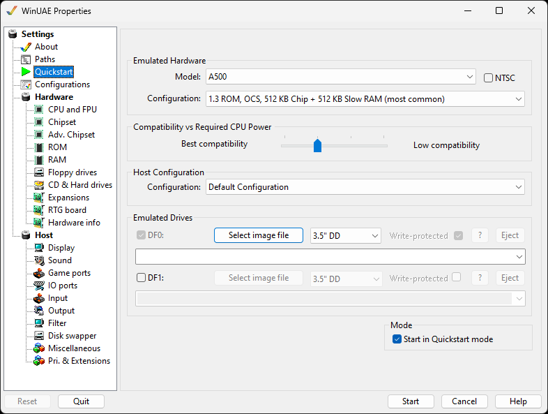

# Quickstart

Setting up WinUAE can be an extremely complex task,
especially for users who are not tech affine. That's where
Quickstart comes in: it will quickly get you going if all you
want is to emulate a certain model of Amiga.  
It is entirely optional.

{ .center }

## Emulated Hardware

**Model** - Select the model of Amiga you want
to emulate e.g. Amiga 500, 2000, 500+, 600, 1000, 1200, 3000,
4000, CD32, CDTV, Arcadia or Expanded UAE example
configuration.  
**Configuration** - Select the common types of
Kickstart, chipset and memory configurations you require from
this list. This list changes depending on the model of Amiga
you selected.

## Compatibility vs required CPU power

**Best - Low compatibility -** Select whether
you want more Amiga chipset compatibility or faster CPU speeds
from this slider.

## Host Configuration

**Configuration** - Select a default, Full
screen 640x480, Full screen 800 x 600 or windowed
configuration.

## Emulated Drives

These options are identical between **Disk drive DF0:
/ Disk drive DF1:**:  
**Select image file** - To load an ADF file to the
emulated drive.  
**3.5" DD / 3.5" HDD** - Allows to select the
emulated floppy drive density.  
**?** - Open the disk image information.  
**Write protect** - Write protect the disk
image.  
**Eject** - Eject the disk image.

## Mode

**Start in Quickstart mode** - If enabled, then
the Quickstart mode is the default.
