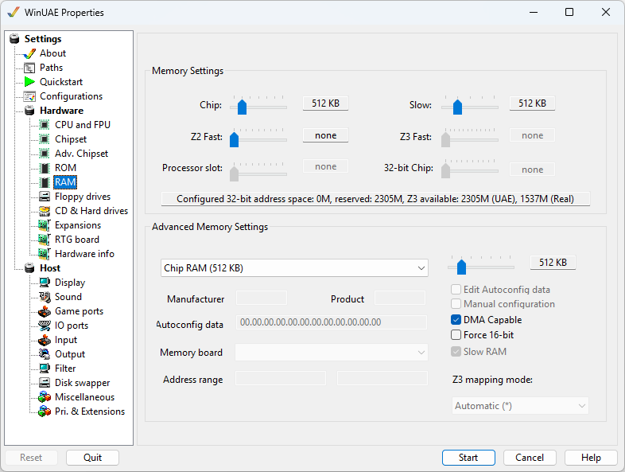

# RAM

These settings let you set up how much memory you will
allocate for the Amiga side.

{ .center }

## Memory Settings

Each slider controls the amount of respective memory to be
used. For an explanation of types of RAM, please see the
[RAM](../background/ram.md) page.  
**32-bit Chip** allows to add additional Chip RAM
in the 32-bit address space. If the maximum of 1GB is
selected, UAE Z3 mapping is always used.  
If a slider's memory is also used as accelerator board RAM,
changing it here adjusts the [accelerator board memory](expansions.md#accelerator-board-settings)
as well.

## Advanced Memory Settings

The **drop down menu** offers selection for all
available RAM slots  
**Slider** adjusts the amount of RAM for the
selected slot (256KB to 8MB)  
**Edit Autoconfig data** Change the Manufacture
code, Product code and Autoconfig data values.  
**Manual configuration** Change the Address range
values.  
**DMA capable** Enable Direct Memory Address
capability.  
**Force 16-bit** Use 16 bit memory addressing.  
**Slow RAM** Enable slow RAM (used by CPU and
Chipset).  

**Z3 mapping mode.** Select Automatic, UAE or real
Zorro 3 mapping mode.  
**Manfacturer, Product, Autoconfig Data** Display
data about memory board.  
**Memory board** Select a UAE, DKB, Kupke or Supra
memory board.  
**Address range** Set address range for
memory.
