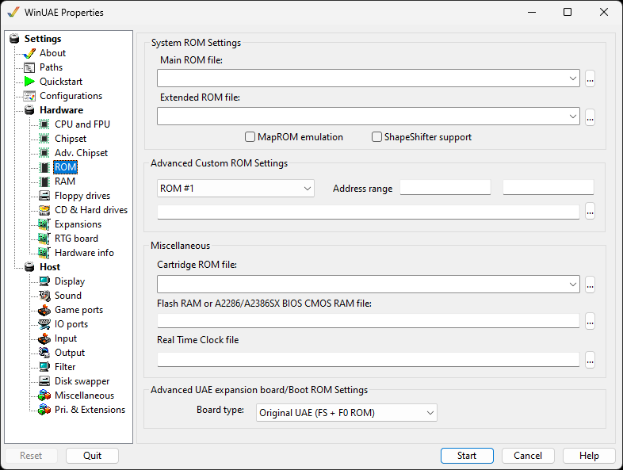

# ROM

These settings control which ROM image(s) WinUAE will use.
At least a [Kickstart ROM](../background/kickst.md)
is required to emulate a classic Amiga.

{ .center }

## System ROM Settings

**Main ROM File** specifies which Kickstart ROM
file to use. ROMs in the specified path will be automatically
detected.  
**Extended ROM File** will provide CDTV or CD32
support (supplied with [Amiga
Forever](../links.md#allinone)).  

**MapROM Emulation** will provide support for
BlitzKick type tools.  
**ShapeShifter support** will enable the [ShapeShifter](../links.md#emulators) 'PrepareEmul'
support, so you don't have to KickShift your ROM-images. This
also allows Amiga Forever users (encrypted ROM-images can't be
KickShift'ed) to use ShapeShifter.

## Advanced Custom ROM Settings

**ROM Number** select a custom rom from 1 to
4.  
**Address Range** can be used to select a memory
address range for ROM code to occupy.  
**ROM file** is the selected rom file to be
loaded.

## Miscellaneous

**Cartridge ROM File** will allow to add Action
Replay ROM files  
**Flash RAM or A2286/A2386SX BIOS CMOS RAM File**
will allow you to save to NVRAM (Non-Volatile RAM) like the
CD32  
**Real Time Clock file** allow you to specify a
RTC file.

## Advanced UAE expansion board/Boot ROM Settings

**Board type**: Original or new UAE, 64K or
128K , Direct or Indirect board types.
