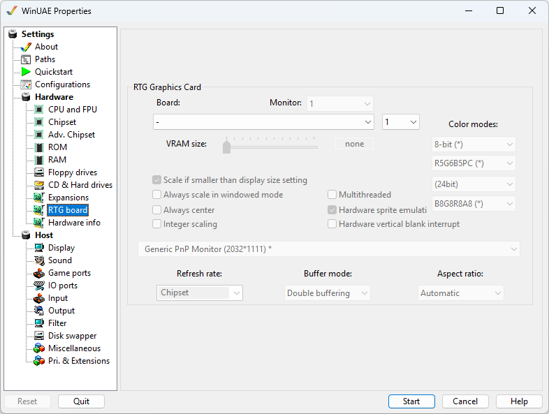

# RTG Board

{ .center }

## RTG Graphics Card

**Monitor**. Multi-monitor selection (default:
1 of 1-4).  
**RTG Graphics Card** to select either of these:
UAE, A2410, Zorro II, Zorro III, Picasso II, Piccolo, Spectrum
EGS-28/24, Picasso II, II+, IV, x86 Bridgeboard VGA Cybervision
64[/3D], Harlequin, Voodoo 3, Virge, or Pixel 64.  
**VRAM size.** Video ram is for graphics card use
such as the Picasso96 RTG so that you can use your PC's
graphics card rather than the custom chips for extra speed.
Upto 512 MB  
**Scale if smaller than display size setting**
Rescale display if current window is smaller than the display
size setting given  
**Always scale in windowed mode** Rescale display
instead if using windowed mode.  
**Always center** Will make sure RTG display is
centered in middle of monitor.  
**Integer scaling** Use integer type scaling for
RTG.  
**Multithreaded** Use RTG board's multithreading
for performance.  
**Hardware sprite emulation** If board supports
it, enable sprite emulation  
**Hardware vertical blank interrupt**
emulation  
**Color modes:** Specify color depth (in bits),
and other modes available for the card.  
**Monitor selection** to select the output screen.
It will be grayed out if only one screen is detected  

**Refresh Rate** This can be Disabled, Chipset,
Real or 50, 60, 70 or 75 Hz.  
**Buffer Mode** This can be Double or Tripe
Buffering for graphics.  
**Aspect Ratio** This can be Disabled, Automatic,
4:3, 5:4, 15:9, 16:10, 27:16, 128:75, 16:9, 256:135, 21:9 or
16:3
