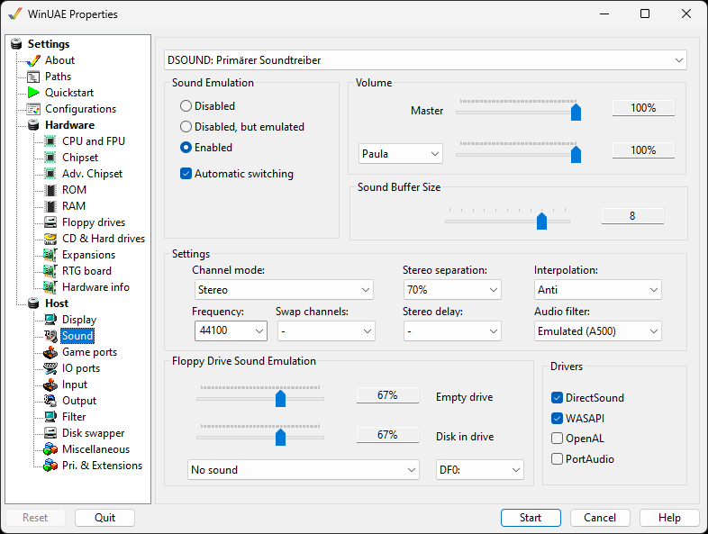

# Sound

Here you can select, if (and how) UAE will provide sound
emulation.

{ .center }

**Sound device** drop down menu to select which
host sound card to use

## Sound Emulation

- **Disabled** causes UAE not to emulate
  sound.
- **Disabled, but emulated** tries to emulate
  most of the sound hardware, but doesn't actually output
  sound.
- **Enabled** will emulate all of the sound
  hardware, and some programs won't work with other
  settings.

**Automatic switching** allows switching
between sound modes automatically.

## Volume

**Master volume**. Set overall volume between
0% (silent) to 100% (loud).  
**Paula,CD,AHI Audio, MIDI, Genlock**. Set audio
from either Paula, direct CD, AHI sound between 0% (silent) to
100% (loud), MIDI Or Genlock.

## Sound Buffer Size

Gives access to the level of the used Direct Sound buffer.
If sound output is choppy, this should be changed.

## Settings

**Channel mode** can be set to Mono, Stereo,
Cloned Stereo or 4 Channel and 5.1 Channels. Stereo will use
more CPU time.  
**Stereo Separation** can be set to improve stereo
sound.  
**Interpolation** improved quality by smoothing
calculation results, but needs more computing power.  
**Frequency** higher Frequency and/or Sample Type,
the higher the sound quality will be, but the slower the
emulation.  
**Swap channels** can be used to swap between
channels for Paula, AHI or both types of Sound chipsets.  
**Stereo delay** can be set to improve stereo
sound.  
**Audio Filter** allows you to emulate Sound Power
LED and can be Always on, Always off or Emulated (for A500 or
A1200).

## Floppy Drive Sound Emulation

This feature enables the Disk Drive sounds like on a real
Amiga so you can hear disks being read or written to. Select a
drive and the Amiga emulation mode to use (A500 by default).
The sliders are the volume controls.

## Drivers

You can enable which host sound drivers you can use to
ensure sound works such as **DirectSound, WASAPI (Windows
Audio Session API), OpenAL, PortAudio**.
