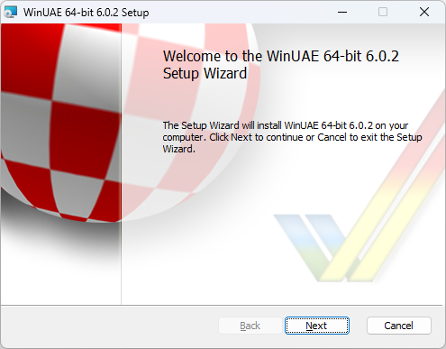

# Getting Started

WinUAE is a complex program that has a lot of configurable
options. This section will help getting it running
easily.

{ .center }

## Topics

- [Requirements](require.md)
- [Info For First Time Users](firsttimeuser.md)
- [Example Configurations](examples.md)
